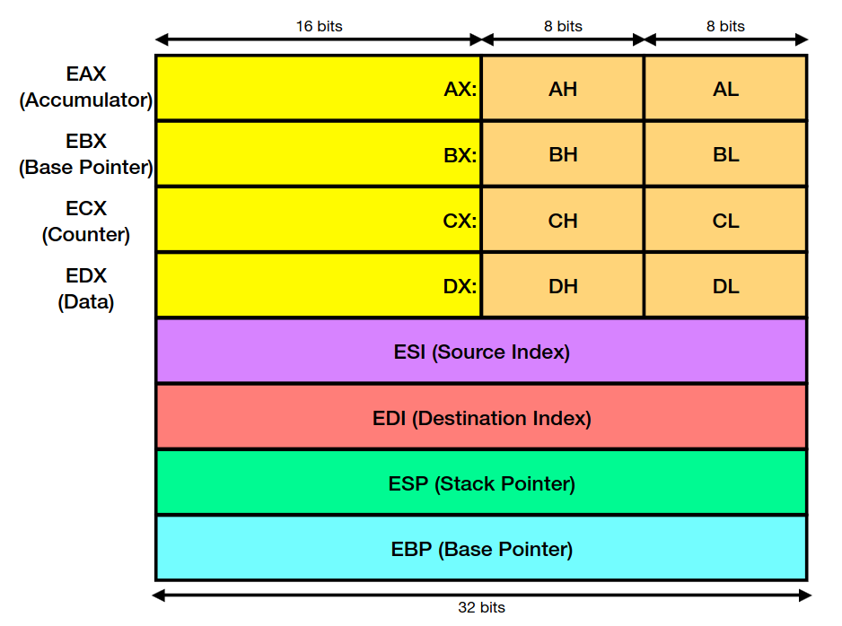
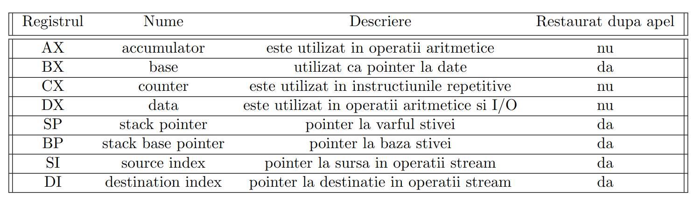
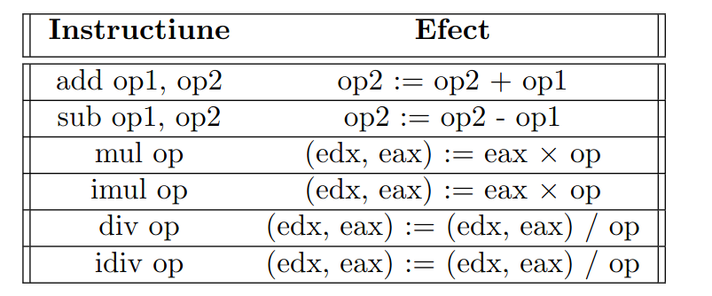
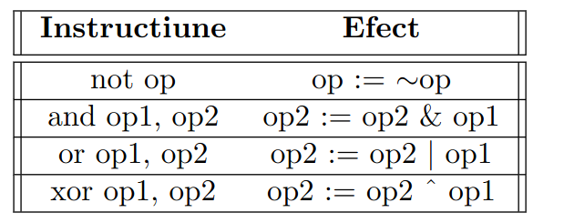
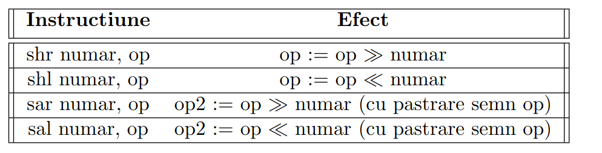
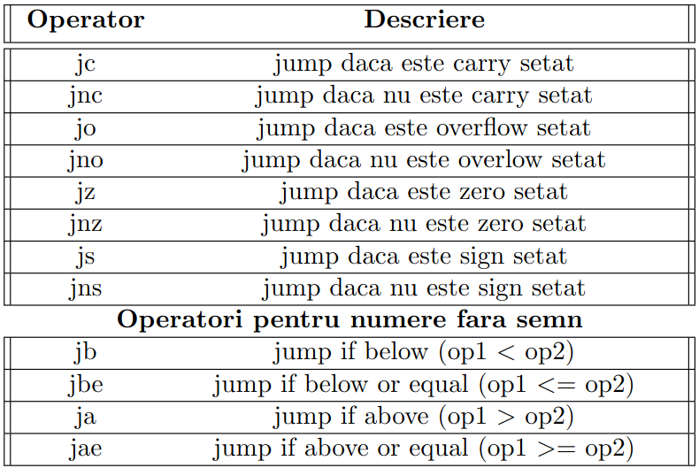
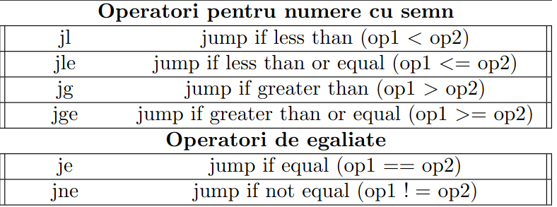
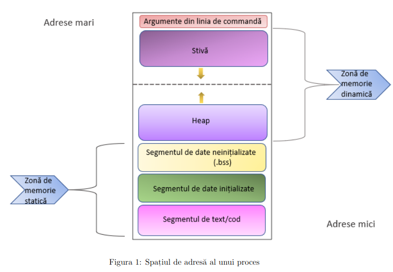
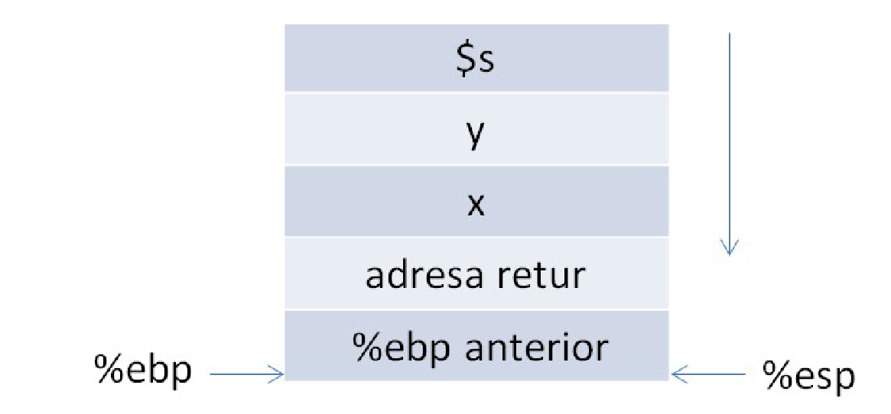
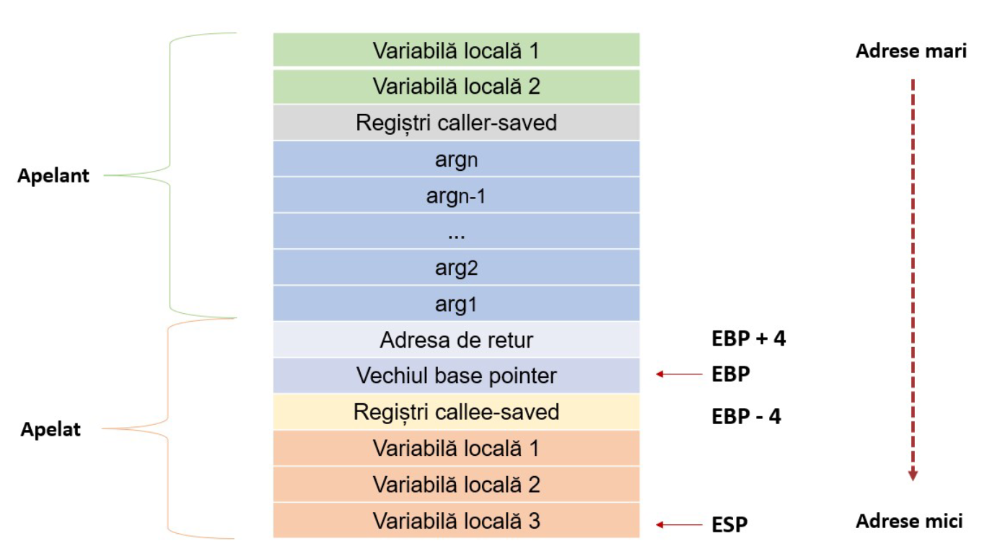

# Contents

1. Arhitectura registrilor
2. Registrii
3. Flags
4. Adrese
5. Tipuri de date
6. Operatori aritmetici
7. Operatori logici
8. Jumpuri
9. Stack
10. Proceduri
11. Cadrul de apel
12. Registrii callee / caller saved

# Arhitectura registrilor

# Registrii

# Flags

Registrii EFLAGS (indicatori) sunt:

- CF - carry flag, care se seteaza daca dupa ultima operatie a avut loc transport;

- PF - parity flag, care este setat daca numarul de biti de 1 din rezultatul ultimei operatii este par;

- ZF - zero flag, care este setat daca rezultatul ultimei operatii a fost 0;

- SF - sign flag, care este setat daca rezultatul ultimei operatii a fost negativ;

- OF - overlow flag, care este setat daca rezultatul ultimei operatii a produs overflow

# Adrese

Pentru a reprezenta adresele de memorie, putem utiliza una dintre urmatoarele variante:

- valoare registru: (%eax); 

- suma constanta, registru: 4(%eax) (= %eax + 4);

- suma dintre doi registri: (%eax, %edx) (= %eax + %edx);

- suma dintre doi registri si constanta: 4(%eax, %edx) (= %eax + %edx +
4);

- suma a doi registri, dintre care unul inmultit cu 2, 4 sau 8, la care putem aduna constanta:
16(%eax, %edx, 4) (= %eax + 4 * %edx + 16);

# Tipuri de date

Avem:

1. byte = 1 byte

2. single = 4 bytes (float)

3. word = 2 bytes

4. long (dword) = 4 bytes

5. quad = ocupa 8 bytes

6. ascii = sir de caractere fara \0

7. asciiz = sir de caractere cu \0

8. space - defineste un spatiu in memorie (.space n = n bytes)

# Operatori aritmetici

**Obs:** (edx, eax) inseamna: $2^{32} \cdot edx + eax$

**Obs:** imul / idiv prelucreaza numere **cu semn**

**Obs:** Pt inmultire / impartire operatorul **op** nu poate fi constanta

# Operatori logici

# Jumpuri

# Stack

**Obs:** Pe stiva pot fi adaugate doar **word-uri** si **long-uri**

Stack pointer-ul **%esp** este registrul care indica intotdeauna
spre varful stivei si prin care se efectueaza **push**-urile, **pop**-urile.

La fiecare push **%esp** scade cu 4

La fiecare pop **%esp** creste cu 4

**Obs:** Varful stivei este la **0(%esp)**

**Obs:** Varful stivei va indica mereu spre ultimul byte a elementului din varf

**Base pointer**-ul este registrul care indica mereu spre baza stack-ului.

# Proceduri

**call** proc - se apeleaza procedura **proc** si se adauga pe
stiva valoare din %eip (instruction pointer) care retine adresa urmatoarei
instructiuni.

Iar %eip preia adresa primei instructiuni din procedura, realizandu-se
astfel continuarea executiei.

**ret** - realizeaza un salt la adresa din varful stivei

# Cadrul de apel

Pentru a nu ne folosi mereu de %esp care se poate modifica pe parcursul
unei proceduri, astfel schimbandu-se valorile de acces, vom crea
un stack frame doar pentru procedura noastra.

Adica vom muta %ebp la %esp atunci cand intram in procedura si il 
vom restabili dupa ce terminam.

Astfel vom avea:

# Registrii callee / caller saved

- callee-saved : %ebx, %esp, %ebp, %esi, %edi.
Valorile acestor registri se garanteaza a fi restaurate de
catre procedura, adica acestea trebuie salvate in zona de variabile
locale de catre procedura.

- caller-saved : %eax, %ecx, %edx. Nu este garantata restaurarea lor. Apelantul trebuie
sa salveze aceste valori inainte de incarcarea argumentelor functiei daca doreste sa regaseasca
valorile initiale la iesirea din functie.

Asa arata un stack frame ideal:

